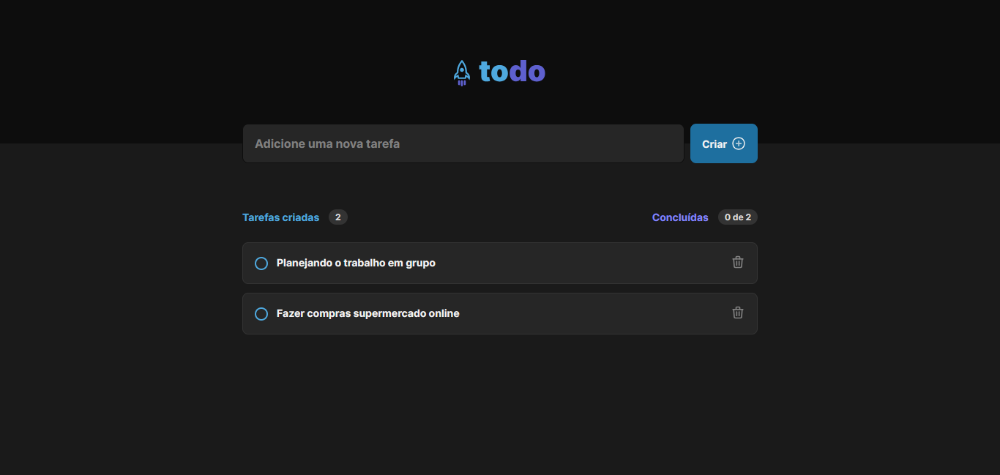
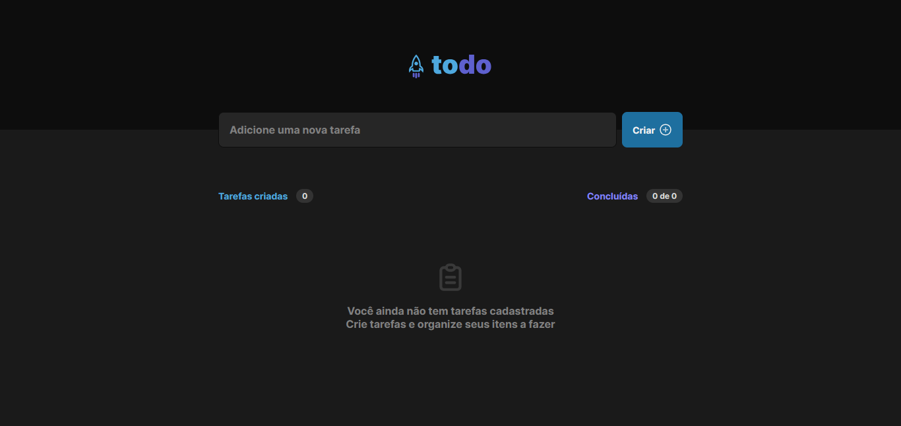
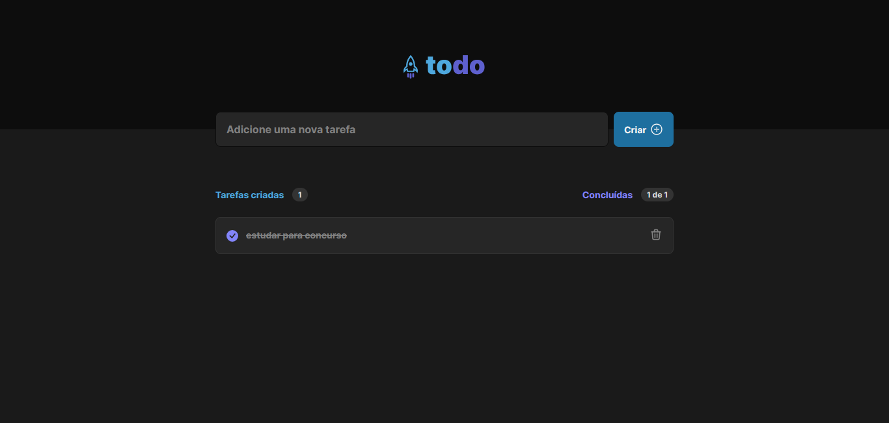

<h1>Lita de Tarefas</h1>

 
## 📝Descrição

Durante este desafio, utilizamos os conceitos básicos do React desenvolvendo do zero uma simples lista de tarefas com as opções de criar e apagar um item da lista.

### 🚀Tecnologias utilizadas:

- Vite
- CSS Modules
- Typescript
- Local Storage

[Roberta Vieira de Melo](https://github.com/VieiraMeloRoberta)